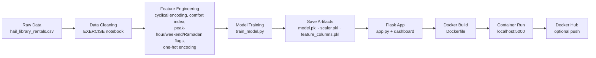

# Library Rentals Demand Prediction API

A production-ready machine learning system that predicts hourly book rental demand across Jeddah public library branches, based on weather conditions, calendar features, and branch/membership context — served through a REST API **and** a full server-rendered analytics dashboard.

Built as an end-to-end MLOps workflow: data cleaning → feature engineering → model training → serving → containerized deployment.

---

## Quick Start (running in under a minute)

This project ships **with its trained model artifacts already included** (`model.pkl`, `scaler.pkl`, `feature_columns.pkl`) and a pre-seeded database (`rentals.db`), so there is no training step required to try it out.

```bash
cd library-rentals-mlops-dashboard
pip install -r requirements.txt
python app.py
```

Open **http://localhost:5000** — the dashboard, prediction wizard, and API are live immediately.

> First run only: `pip install` needs to download ~7 packages (Flask, XGBoost, scikit-learn, pandas, numpy, joblib, gunicorn), which takes a bit depending on your connection. Every run after that, `python app.py` boots in about a second — it just loads three small `.pkl` files and opens the SQLite database.

Quick sanity check once it's running:

```bash
curl http://localhost:5000/health
# {"status": "ok"}
```

### Prerequisites
- Python 3.11+ (tested through 3.12)
- Docker (optional, for containerized deployment)

---

## Overview

| | |
|---|---|
| **Model** | XGBoost Regressor (R² = 0.964, MAE ≈ 3.07 rentals) |
| **Serving** | Flask REST API + Jinja2 dashboard, run via Gunicorn in production |
| **Deployment** | Docker container |
| **Storage** | SQLite (`rentals.db`) — actual + predicted rentals, clearly labeled |
| **Input** | Weather + date + branch/category context (JSON) |
| **Output** | Predicted rental count (JSON) |

The API reproduces the *exact* feature engineering pipeline used during training — cyclical time encoding, comfort index, peak-hour/weekend/Ramadan flags, temperature binning, and one-hot encoding — so a caller only needs to send raw, human-readable fields. No manual feature computation required.

---

## Project Structure

```
.
├── app.py                     # Flask API + dashboard routes (serving)
├── database.py                # SQLite schema, seeding, and query helpers
├── train_model.py             # Cleans raw data, trains XGBoost, saves artifacts
├── model.pkl                  # Trained XGBoost model
├── scaler.pkl                 # Fitted StandardScaler
├── feature_columns.pkl        # Exact column order/names from training (45 features)
├── cleaned_rentals.csv        # Output of the cleaning pipeline, used to seed the DB
├── hail_library_rentals.csv   # Raw source dataset
├── rentals.db                 # SQLite database (auto-created/seeded on first run)
├── requirements.txt           # Python dependencies
├── Dockerfile                 # Container build definition
├── .dockerignore               # Files excluded from the Docker image
├── .gitignore                  # Files excluded from Git version control
├── templates/                 # Jinja2 pages: dashboard, predict wizard, records
├── static/                    # CSS + vanilla JS for the dashboard
├── Library_Rentals_Hail_Project_EXERCISE.ipynb   # Original data cleaning/EDA notebook
├── model_metrics.txt          # Held-out evaluation metrics from the last training run
├── README.md                  # This file
└── TROUBLESHOOTING.md         # Docker & environment troubleshooting guide
```

> **Note on Git:** `.gitignore` excludes `*.pkl`, `*.csv`, and `*.db` to keep repository history lean if you push this to GitHub. That means a fresh `git clone` of this repo will **not** include them — run `python train_model.py` after cloning to regenerate `model.pkl`, `scaler.pkl`, `feature_columns.pkl`, and `cleaned_rentals.csv`. This delivered copy already has all of them, which is exactly why it runs immediately without a training step.

---

## Workflow

The project follows a standard end-to-end MLOps pipeline, from raw data to a deployable containerized API:



**Stage breakdown**

| Stage | What happens | File(s) involved |
|---|---|---|
| 1. Data Cleaning | Standardize categorical text, fix inconsistent values, handle missing data | `*.ipynb`, `train_model.py` |
| 2. Feature Engineering | Derive `Comfort_Index`, `Hour_sin/cos`, `Month_sin/cos`, `Is_Peak_Hour`, `Is_Weekend`, `Is_Ramadan`, `Temperature_Bin`, one-hot encode categoricals (45 features total) | `*.ipynb`, `train_model.py` |
| 3. Model Training | Split data, scale features, fit XGBoost, evaluate | `train_model.py` |
| 4. Save Artifacts | Persist model, scaler, and exact feature column order | `model.pkl`, `scaler.pkl`, `feature_columns.pkl` |
| 5. Serving | Reconstruct the same feature pipeline from raw JSON input, load artifacts once at startup, expose `/predict`, `/health`, and the dashboard | `app.py` |
| 6. Containerize | Package the app + dependencies + artifacts into a portable image | `Dockerfile`, `.dockerignore` |
| 7. Deploy / Share | Run the container locally, or push to Docker Hub for use on any machine | `docker build`, `docker run`, `docker push` |

Each stage's output feeds directly into the next, so retraining the model (stage 3) automatically flows through to a new deployable image once you rebuild the container (stage 6) — no manual feature-mapping updates needed, since `app.py` reads `feature_columns.pkl` dynamically.

---

## Web Dashboard & Prediction UI

Beyond the raw `/predict` API, the app ships a full server-rendered web interface:

| Route | Purpose |
|---|---|
| `GET /` | Dashboard — KPI cards, daily actual-vs-predicted trend, hourly demand, branch/category breakdowns, recent activity (Chart.js) |
| `GET /predict-form` | A 4-step guided wizard (date/hour → weather → branch/category → review) that calls the model and **saves the result to the database** |
| `GET /records` | Full searchable, filterable, paginated ledger of every row — actual and predicted |
| `GET /api/stats`, `/api/records`, `/api/branches` | JSON endpoints backing the UI |
| `POST /api/predict-and-save` | Same feature pipeline as `/predict`, but persists the row |
| `DELETE /api/records/<id>` | Deletes a single record (actual or predicted) |

### Database: `rentals.db` (SQLite)

`database.py` creates a `rentals` table on first run and seeds it with the cleaned historical CSV. Every row carries a **`Data_Source`** column set to either:

- `Actual` — real historical records from `hail_library_rentals.csv`
- `Predicted` — rows generated by the model through the wizard or `/api/predict-and-save`, additionally tagged with `Model_Version` and `Created_At`

This makes it possible to audit at a glance which numbers in the ledger are ground truth and which are model output — nothing is silently mixed together.

---

## API Reference

### `GET /health`

Health check endpoint.

**Response**
```json
{ "status": "ok" }
```

---

### `POST /predict`

Predicts rental count for a given hour/context. Pure prediction — does not touch the database.

**Request body**

| Field | Type | Example | Description |
|---|---|---|---|
| `Date` | string | `"2024-07-15"` | Used to derive month, weekday, quarter, Ramadan flag |
| `Hour` | int | `14` | Hour of day (0–23) |
| `Temperature_C` | float | `32` | Temperature in °C |
| `Humidity_pct` | float | `40` | Humidity percentage |
| `Wind_Speed_ms` | float | `3.2` | Wind speed (m/s) |
| `Visibility_m` | float | `9000` | Visibility (meters) |
| `Solar_Radiation_MJm2` | float | `2.1` | Solar radiation (MJ/m²) |
| `Rainfall_mm` | float | `0` | Rainfall (mm) |
| `Season` | string | `"Summer"` | Winter / Spring / Summer / Autumn |
| `Holiday` | string | `"No"` | `"Yes"` or `"No"` |
| `Library_Branch` | string | `"Downtown Central"` | Branch name |
| `Top_Category` | string | `"Fiction"` | Most-rented category that hour |
| `Membership_Type` | string | `"Student"` | Dominant membership type |

**Example request**

```bash
curl -X POST http://localhost:5000/predict \
  -H "Content-Type: application/json" \
  -d '{
    "Date": "2024-07-15",
    "Hour": 14,
    "Temperature_C": 32,
    "Humidity_pct": 40,
    "Wind_Speed_ms": 3.2,
    "Visibility_m": 9000,
    "Solar_Radiation_MJm2": 2.1,
    "Rainfall_mm": 0,
    "Season": "Summer",
    "Holiday": "No",
    "Library_Branch": "Downtown Central",
    "Top_Category": "Fiction",
    "Membership_Type": "Student"
  }'
```

**Example response**

```json
{ "predicted_rentals": 81.34 }
```

**Error response** (missing/invalid field)

```json
{ "error": "'Date' is required and cannot be blank" }
```

---

### `POST /api/predict-and-save`

Identical inputs/logic to `/predict`, but also writes the row to `rentals.db` with `Data_Source: "Predicted"`. Used by the dashboard's prediction wizard.

**Example response**

```json
{
  "id": 6319,
  "predicted_rentals": 81.3,
  "data_source": "Predicted",
  "model_version": "xgb-v1"
}
```

---

## How Predictions Are Computed

The model was trained on **45 engineered features**. `app.py` reconstructs all of them internally from the raw payload above:

- **Cyclical encoding** — `Hour_sin/cos`, `Month_sin/cos` (captures the circular nature of time)
- **Comfort_Index** — `Temperature_C - 0.55 * (1 - Humidity_pct/100) * (Temperature_C - 14.5)`
- **Is_Peak_Hour** — 1 if hour is 9–11 or 16–19
- **Is_Weekend** — 1 if Friday or Saturday
- **Is_Ramadan** — 1 if `Date` falls within a known Ramadan window
- **Temperature_Bin** — Cool (<25°C) / Warm (25–49°C) / Hot (>49°C)
- **One-hot encoding** — `Season`, `Library_Branch`, `Top_Category`, `Membership_Type`, `Day_of_Week`, `Holiday`, quarter — aligned exactly to `feature_columns.pkl` so dropped baseline categories are correctly encoded as all-zero rows.

---

## Model Performance

From the last training run (see `model_metrics.txt`), evaluated on a held-out test split:

| Metric | Value |
|---|---|
| R² | 0.9644 |
| MAE | 3.07 rentals |
| RMSE | 4.15 rentals |
| Features | 45 |
| Train / Test rows | 5,054 / 1,264 |

To retrain the model from scratch:

```bash
python train_model.py
```

This regenerates `model.pkl`, `scaler.pkl`, `feature_columns.pkl`, and `cleaned_rentals.csv` from `hail_library_rentals.csv`. Delete `rentals.db` afterward if you want the dashboard reseeded from the freshly cleaned data:

```bash
rm -f rentals.db
python app.py
```

---

## Docker

```bash
# Build
docker build -t rentals-api .

# Run
docker run -p 5000:5000 rentals-api

# Run on a custom port
docker run -p 6000:6000 -e PORT=6000 rentals-api

# Push to Docker Hub
docker login
docker tag rentals-api <your-dockerhub-username>/rentals-api:v1
docker push <your-dockerhub-username>/rentals-api:v1
```

The image runs on Gunicorn (1 worker, 60s timeout) with a built-in `HEALTHCHECK` against `/health`, and starts serving within seconds of the container coming up — no build-time training step, since the `.pkl` artifacts are copied straight into the image.

> Having Docker issues? See [`TROUBLESHOOTING.md`](./TROUBLESHOOTING.md).

---

## Tech Stack

- **Python 3.11+**
- **XGBoost** — model
- **scikit-learn** — preprocessing (StandardScaler)
- **Flask** — API serving + server-rendered dashboard (Jinja2)
- **Gunicorn** — production WSGI server (used in Docker)
- **SQLite** — persistent storage for actual + predicted rentals
- **Chart.js** — dashboard visualizations
- **Docker** — containerization
- **pandas / numpy** — feature engineering

---

## License

This project was built as part of an educational MLOps exercise. Feel free to fork and adapt.